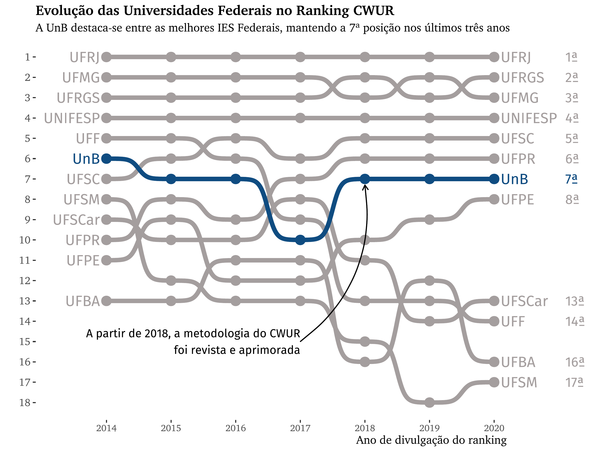

# CWUR Ranking
## Data analysis of the CWUR ranking in Brazil

In this project, I extracted the tables from https://cwur.org/ regarding the results in the World University Rankings, ranging from 2014 to 2020.
I say extracted because there's no 'download' button on the page, so I first inspected the HTML (ctrl + shift + i) then extracted the contents from each table in each year. I intend to automatize that soon.

For now, there's the script (analise_cwur.R) that loads all the data, inspects and cleans all variables to create a clean dataset. From there, Brazil is set as the country of choice to create a visual narrative of its evolution between 2014 and 2020, compared to its Federal peers. Two additional tables are created to support the plot and add information.

 

