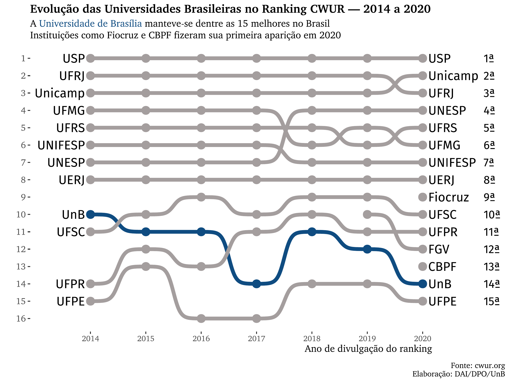
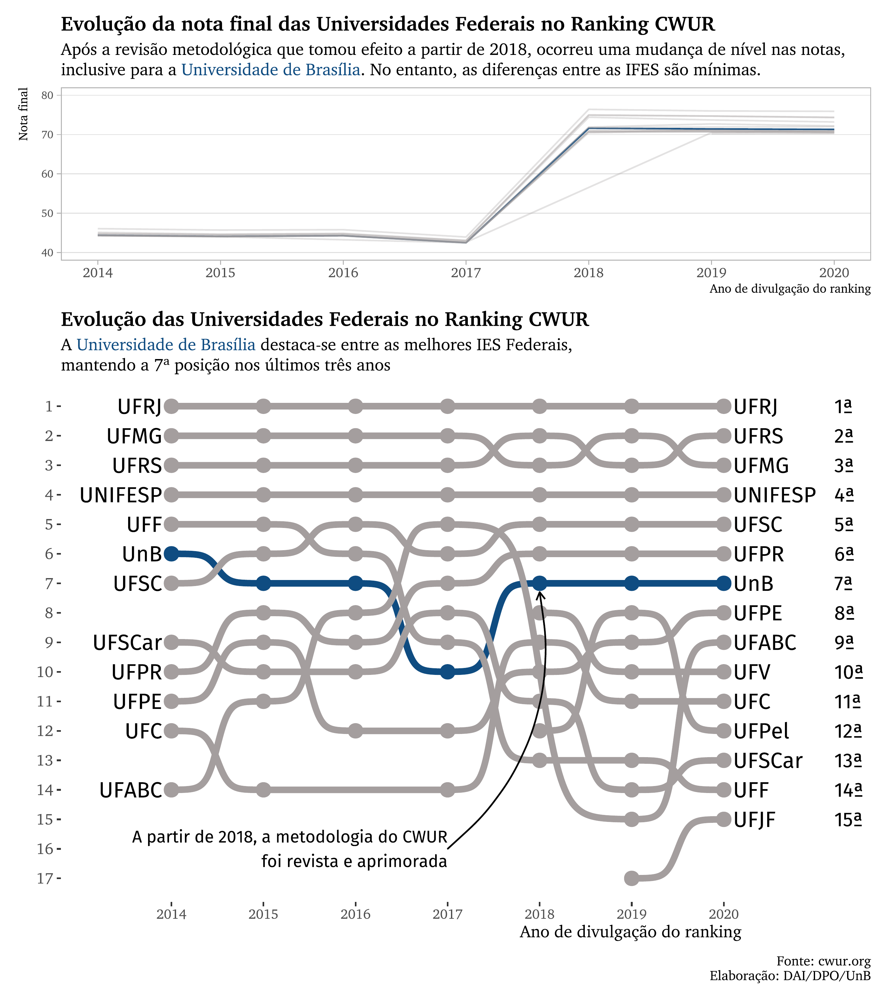

# CWUR Ranking
## Data analysis of the CWUR ranking in Brazil

In this project, I extracted the tables from https://cwur.org/ regarding the results in the World University Rankings, ranging from 2014 to 2020.
I say extracted because there's no 'download' button on the page, so I first inspected the HTML (ctrl + shift + i) then extracted the contents from each table in each year. I intend to automatize that soon.

For now, there's the script (01_gera_dados.R) that load all the data, inspects and cleans all variables to create a clean dataset. From there, Brazil is set as the country of choice to create a visual narrative of its evolution between 2014 and 2020, highlighting the University of Brasília.

The first plot shows how the first 15 superior education institutions in Brazil performed from 2014 to 2020, according to CWUR's metrics. The code is in 02_grafico_nacional_15primeiras.R.

The second plot tells a more realistic scenario: how UnB fares in comparison to its Federal peers. For this I compounded two plots in one, using the patchwork package. The top one exhibits the final score evolution, to show that the differences between institutions aren't significant. Just below it is the plot with the rank's evolution, just like the country-wise plot. The script is 03_grafico_federal.R.

